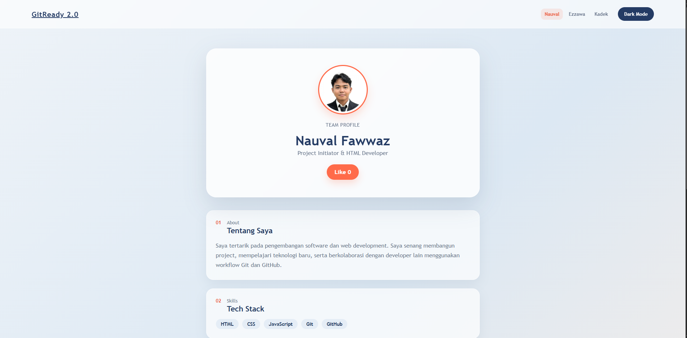

# GitReady 2.0 — Team Profile

Team Profile adalah halaman profil interaktif yang dibuat sebagai study case GitReady 2.0 untuk mempraktikkan kolaborasi menggunakan Git dan GitHub.

---

## Visualisasi



Live Demo: Coming Soon

---

## Tech Stack

- HTML5
- CSS3
- JavaScript (Vanilla)
- Git & GitHub

---

## Fitur Utama

- [x] Toggle Dark Mode
- [x] Like Counter
- [x] Member Profile Navigation
- [x] Responsive Layout
- [x] GitHub Profile Link

---

## Contribution

| Nama | Role | Kontribusi |
|---|---|---|
| Nauval Fawwaz | Project Initiator | Membuat repository, struktur `index.html`, mengatur branch utama, review dan merge |
| Muhammad Ezzawa Nidlomuddin | Styling Engineer | Membuat branch `feature/styling`, menambahkan dan menghubungkan `style.css` |
| Kadek Mahesa Arta Wibawa | Script Engineer | Membuat branch scripting, menambahkan dan menghubungkan `script.js` |

---

## How to Run

1. Clone repository:

```bash
git clone https://github.com/NauvalFawwaz/bnccgit.git
```

2. Masuk ke folder project:

```bash
cd bnccgit
```

3. Buka `index.html` menggunakan browser atau Live Server.

---

## What I Learned

Melalui project ini, kami mempraktikkan penggunaan Git dan GitHub untuk bekerja dalam satu project, mulai dari branching, commit, push, Pull Request, code review, menyelesaikan merge conflict, hingga menggabungkan perubahan ke branch utama.

---

## Feature Improvement

- Menyimpan like counter menggunakan `localStorage`
- Menambahkan animasi transisi antar profil
- Meningkatkan accessibility
- Deploy project menggunakan GitHub Pages
